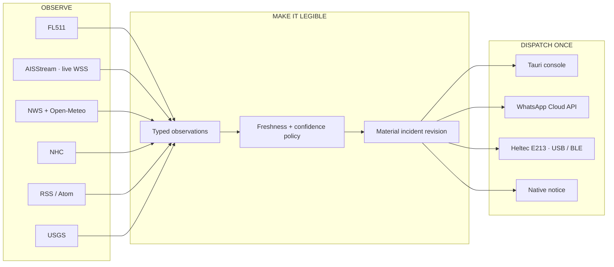
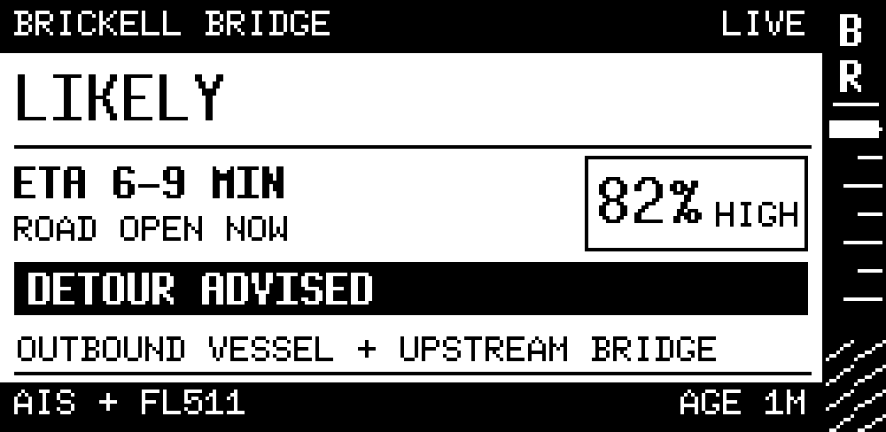
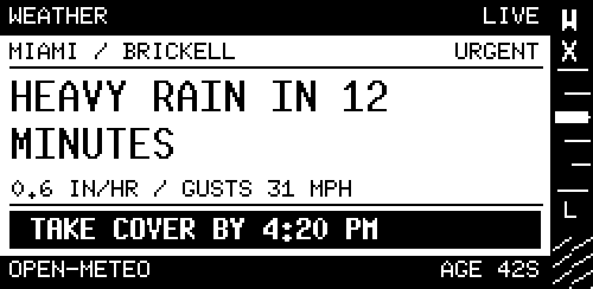
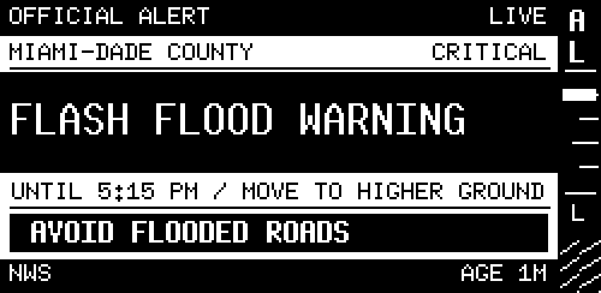

<p align="center">
  
</p>

<p align="center">
  
  
  
  
  
</p>

<p align="center">
  <strong>Advance bridge warning. Personal weather desk. Official alert receiver. Storm watch. News wire.<br />
  One quiet, inspectable signal console—with the judgment to know when to shut up.</strong>
</p>

---

> **Because “the camera shows the bridge is already up” is not an advance-warning system. That is a receipt.**

**PuenteGonorrea** is the repo. **Tender’s Log** is the instrument inside it: a local-first desktop console that combines live AISStream vessel positions, source freshness, user policy, and confidence-weighted evidence into one consistent decision for the screen, WhatsApp, native notices, and a 2.13-inch Heltec e-paper board.

The flagship channel predicts a likely Brickell Avenue Bridge opening *before* cars stack up. The same engine also handles rain heads-ups, NWS warnings, tropical systems, user-chosen news feeds, earthquakes, and future channels without turning your life into a notification casino.

> **Proof-of-concept status · August 15, 2026:** AISStream accepts the Brickell subscription but is not returning usable vessel detail; [similar no-message reports remain open](https://github.com/aisstream/aisstream/issues/30). We are monitoring the feed. [Concurrent Namecheap VPS maintenance](https://www.namecheap.com/status-updates/planned-hardware-maintenance-on-vps-hosting-august-14-2026/) may be relevant, but no causal link is confirmed. FL511 is collecting Brickell and upstream bridge events into a local event graph; after several days of real data, alert thresholds and timing will be tuned against those patterns.

## The whole signal desk

Every channel below has a real master switch, visible operating state, source
health, and its own collection, presence, interruption, and routing controls.
Weather is not a hard-coded side quest; stocks are not an ornamental card; a
disabled gate stops its work instead of merely hiding the result.

| Channel | Drinks from | What the user can decide | Delivery |
|---|---|---|---|
| **Brickell bridge** | AISStream live vessel positions + FL511 target/upstream state + legal schedule | Bridge-centered AIS radius, evidence gates, freshness, interrupt threshold, routes | Desktop · WhatsApp · E213 |
| **Rain + weather** | Open-Meteo current/hourly forecast | Map-picked areas, independent rain/wind gates, probability, lead time, visibility | Rotation · heads-up · E213 · desktop |
| **Official alerts** | NWS CAP/GeoJSON | Map-picked U.S. areas, qualifying severity, statements, quiet-hour critical bypass | Interrupt · WhatsApp · desktop · E213 |
| **Tropical systems** | NHC CurrentStorms + fixed Atlantic outlook RSS | One honest basin-wide activation gate; local-impact and track/change analysis are marked unavailable | Context-only by default · opt-in active notices |
| **Breaking/local news** | User-configured HTTPS RSS or Atom | Feed URLs, include/exclude terms, breaking-only, maximum items/age | Rotation only when a matching item exists; explicit notices |
| **Earthquakes** | USGS significant feeds | Feed class, minimum magnitude, maximum event age | Active-only · explicit notices |
| **Markets** | Optional Yahoo Finance Chart source (no credentials) | Symbols, previous-close move threshold, refresh cadence | Rotation · E213 · material-change notices; **disabled by default** |

The tropical desk is deliberately narrow: it can report current Atlantic
systems and retain the official Atlantic outlook, or the user can opt into an
“every active Atlantic cyclone” rule. It does **not** pretend a selected map
point is under threat, compare forecast tracks, or detect advisory/intensity
revisions without an additional history and forecast-track adapter.

No passive GPS. No phone-location scrape. No mystery geofence. The app can take one OS-authorized location sample only when the user presses **Locate this Mac once**; it never follows the device afterward. Miami and Brickell ship only as public, editable presets, and every forecast or alert point belongs to the local user profile. Location search text is sent to Open-Meteo geocoding; the visible map requests OpenFreeMap tiles; after save, enabled weather sends the selected point to Open-Meteo and enabled U.S. official alerts send it to NWS. Per-area source gates stop those requests independently.

Location setup happens on one shared MapLibre world map: search anywhere,
pan and zoom, drag the live pin into place, name the area, choose exactly which
channels may use it, and save. Raw latitude/longitude lives behind an
**Advanced coordinates** disclosure. Map tiles stay on the network, so the map
can be rich without inflating a tiny desktop installer with a planet.

## How a signal earns your attention



Three user choices stay deliberately separate:

1. **What is collected?** Sources, location, feeds, thresholds, and freshness.
2. **What is shown?** Home channel, normal rotation, active-only, messages-only, or off.
3. **What may interrupt—and where?** Recommended, confirmed-only, meaningful, or never; then E213, desktop, or WhatsApp. The custom-rule slot parks fail closed until a detailed matrix exists.

Enabling a news feed does not grant it permission to message you. Removing weather from the display does not silently disable an official-alert dependency. A disabled or stale source does not become `CLEAR` just because that would look nicer.

## Bridge confidence, not bridge clairvoyance

The bridge channel is an explainable, time-decaying predictor—not a binary sensor wearing a confidence badge.

| State | Plain meaning | Typical evidence | Interrupt default |
|---|---|---|---|
| `CLEAR` | No current predictive evidence | Fresh controller closed; no candidate vessel | No |
| `WATCH` | Opening is possible, not predicted | Legal context or weak precursor | No |
| `LIKELY` | High or Very High predictive confidence supports an opening soon | Ordered outbound bridge progression and/or AISStream approach evidence | Yes |
| `OPEN` | FL511 confirms the span is open | Fresh FL511 controller ground truth | Yes |
| `UNKNOWN` / `STALE` | The system cannot support a trustworthy claim | Missing, expired, or contradictory sources | Written prominently |

Every prediction retains directional evidence contributions, reliability, freshness decay, legal context, ETA range, and transition hysteresis. Schedule eligibility alone is capped at `WATCH`; exceptions mean there is never a guaranteed public warning window. AISStream is a real optional source, backed only by the live provider.

<details>
<summary><strong>Why FL511 matters—and why it is behind an adapter</strong></summary>

FL511 currently exposes a first-party bridge layer that reports Brickell and upstream Miami River bridge state. It provides authoritative confirmation and useful upstream evidence, but its route is undocumented. Tender’s Log discovers the bridge by coordinates and tooltip name instead of trusting one permanent numeric ID, fixture-tests the schema, polls backend-side, and turns drift into `UNKNOWN` rather than a false `DOWN`.

</details>

## A live vessel feed, without a radio rack

The AIS source is gloriously practical: bring an **AISStream API key**, point the
bridge channel at the bridge you care about, choose a **2–30 km approach
radius**, and save. The Rust backend derives the bounding box, opens the WSS
stream, filters positions into the bridge envelope, and turns matching movement
into freshness-aware predictor evidence. No SDR, marine radio, browser tab, or
raw bounding-box surgery required.

The desktop makes the entire circuit inspectable under **Outputs → AISStream**:

- `PARKED`, `NEEDS KEY`, `ARMED`, `LIVE`, and `NEEDS ATTENTION` are different states. `ARMED` means the collector can run; only fresh received positions earn `LIVE`.
- The API key comes from the app’s private local credential file or an ignored
  local `AISSTREAM_API_KEY` in `.env`; it never enters preferences or SQLite.
- Coverage follows the saved bridge pin. Move the bridge on the map and the next saved connection follows it.
- When enabled, the backend sends the saved bridge-centered bounding box and API key to AISStream over WSS. The UI never connects browser-side, and the app never samples location passively.
- Key management is at [AISStream](https://aisstream.io/customer.html). The provider is a beta source with no SLA, so disconnects, schema trouble, and stale positions become visible degradation—not invented calm.

AIS is powerful evidence, not magic clearance telemetry. Not every vessel
transmits it, reception can be absent or delayed, and standard messages do not
reliably include air draft. A vessel converging on the Miami River approach can
raise confidence; it cannot prove that vessel needs the bridge opened.

## The little screen that refuses to be ignored

The supported board is the **Heltec Vision Master E213 / ESP32-S3 / 2.13-inch e-paper**, including the no-LoRa model. LoRa is not required.

<table>
  <tr>
    <td width="33%" align="center">
      <br />
      <sub><strong>BRIDGE LIKELY</strong><br />ETA, confidence, evidence</sub>
    </td>
    <td width="33%" align="center">
      <br />
      <sub><strong>RAIN HEADS-UP</strong><br />Personal forecast rule</sub>
    </td>
    <td width="33%" align="center">
      <br />
      <sub><strong>OFFICIAL ALERT</strong><br />Authority and next action</sub>
    </td>
  </tr>
</table>

- **Safe default:** a fresh profile starts in **Preview only** and writes to no hardware.
- **USB:** native CDC serial, discovered by an explicit scan and selected before any bytes are written.
- **Bluetooth:** a direct app-level GATT session to the public INK1 service—not OS pairing or bonding.
- **Protocol:** backward-compatible `INK1`, 250 × 122 monochrome framebuffer, CRC32, and an explicit `ACK INK1` before a frame is called delivered. The ACK proves receipt, not sender identity.
- **Display grammar:** words, rules, source labels, and ordering survive monochrome. Color is never part of the safety contract.
- **Writer discipline:** one device writer, paced chunks, and no Automatic reconnect until the user has explicitly scanned for and selected a device. Automatic never scans and attaches on its own; it prefers an explicitly configured USB port when one exists, then reuses the selected Bluetooth route.

Setup is visual and testable: leave Preview only when you want a physical display, choose Automatic, USB, or Bluetooth, save, scan, select the discovered `InkDock E213`, connect, then send the current frame. The app marks the transport route healthy only after `ACK INK1`; that health means end-to-end receipt, not trusted device identity. Closing the configuration window hides it instead of killing the service—the predictor and delivery engine continue under the macOS menu-bar icon. Background reconnect targets only the device the user explicitly selected; it never attaches to an arbitrary matching advertisement.

<details>
<summary><strong>Connect an E213 over Bluetooth Low Energy</strong></summary>

The board has no controls to operate. Power it, then perform every action in
the Tender's Log desktop window; the named controls below are app buttons.

1. Flash the Tender's Log firmware for the board revision and power the E213.
   Its setup screen should read `READY / USB + BLE`.
2. Open **Outputs → E-paper**. A fresh profile is **Preview only**. Select
   **Bluetooth only** or **Automatic**, press **Save output settings**, then
   press **Scan nearby**.
3. Allow Bluetooth when the operating system asks. Tender's Log connects
   directly to the board's BLE GATT service. This is an app-level connection,
   not an OS pairing or bonded-device record.
4. Find `InkDock E213` in **Discovered now**, press **Connect**, and watch the
   route move through `SCANNING`, `CONNECTING`, and `BLE CONNECTED`.
5. Press **Send current frame**. Only `ACK INK1` from the physical display turns
   the route healthy.
6. Close the window if you like. The service remains in the menu bar; choose
   **Open Tender's Log** to configure it again or **Quit Tender's Log** to stop
   collection and delivery.

USB uses the same current-frame proof and takes precedence in **Automatic**
mode after a device has been explicitly selected.
The interface keeps disconnection, permission denial, transport failure, and
unacknowledged delivery visibly distinct.

**BLE security boundary:** INK1 does not authenticate or encrypt its GATT
characteristics. A nearby Bluetooth client that knows the published service
UUID could write a different frame. `ACK INK1` confirms complete frame receipt;
it does not authenticate the sender. Even when Tender's Log itself uses USB, a
powered board still advertises its BLE service. Treat the E213 as a glanceable
companion display—not the sole authority for a safety or security decision.

</details>

The firmware lives in [`firmware/e213`](firmware/e213). The renderer and transports live in [`crates/eink`](crates/eink).

## WhatsApp, minus the cursed browser automation

Tender’s Log talks to the official **Meta WhatsApp Cloud API**. It does not remote-control WhatsApp Web, steal a browser session, or pretend an HTTP `200` means your friend saw the alert.

- Approved template name + language are configuration.
- Proactive recipients require explicit opt-in.
- Access tokens live in the app-data credential file with owner-only permissions on Unix, not SQLite, logs, or Git.
- The desktop records Meta's send acceptance only. It does not ship an unused
  public webhook listener or pretend to know delivered/read status.
- The desktop records Meta `accepted`; it does not infer delivery or reads.
- The desktop app has no inbound message listener: an operator must record an opt-out as **Unsubscribed** in Outputs. Automatic `STOP` handling requires a signed public relay.
- Incident + material revision + route + action form the deduplication key.
- Dispatch is intentionally at-least-once across an ambiguous network failure. If Meta accepts a message but its response or the local acknowledgement is lost, a retry can rarely duplicate an alert; this prefers a duplicate over silent loss and does not pretend a custom local idempotency header is a Meta guarantee.
- Dry-run delivery is first-class for setup and tests.

Native desktop notices are intentionally labeled **best-effort**. The pinned macOS notification bridge confirms only that it queued host work, not that Notification Center displayed or the user read it; Tender’s Log therefore never promotes those notices to delivered and never infers an all-clear from that unconfirmed submission.

The UI makes the route consequence explicit under **Outputs → WhatsApp**. A token is optional; the rest of the console keeps working without Meta credentials.

## Configuration without spelunking through TOML

The desktop app is the primary configuration surface:

| Screen | The calm, engineer-facing part |
|---|---|
| **Live** | Current decision, timing, evidence rail, freshness, channel roster, durable outbound work |
| **Channels** | Collection scope, location, thresholds, feeds, order, presence, interrupt preset, destinations |
| **Map** | Global pan/zoom map, live AIS vessel courses, search, draggable pins, one-shot device location, per-location source gates |
| **Policy** | Named profiles, quiet hours, explicit critical bypass, per-channel interrupt register |
| **Outputs** | AISStream source/key/radius/health, E213 USB/BLE/render-only mode, frame cadence, WhatsApp template and recipient, native notices |
| **Log** | Durable FL511 bridge intervals plus WhatsApp revisions, provider-acceptance outcomes, filters, and sanitized JSON export |
| **System** | Collector age, source health, live SQLite use, runtime version, redacted diagnostics |

Meta and AISStream secrets live in a private per-user credential file; AISStream
can also use the ignored local `.env` development file. The rest of the local-data
boundary is intentionally plain: saved exact areas, WhatsApp recipient and
consent records and pending or retryable message
envelopes live in ordinary **unencrypted per-user SQLite** until the user edits
or scrubs them or retention pruning removes them. Tender’s Log relies on the OS
account and disk protection for that database; it does not claim application-
level database encryption. The console requires the native desktop runtime. It
does not substitute browser storage or fabricated observations when that
runtime is unavailable.

<details>
<summary><strong>Example: a user-defined Miami rain heads-up</strong></summary>

```text
Map → Search “Miami, FL” → Tune amber pin → Add location

Weather & rain       enabled for Miami
Official alerts      enabled for Miami
Tropical context     enabled for Miami

Channels → Miami weather → Content scope

Rain heads-up        enabled · 60% · 90 minutes ahead
Wind-gust heads-up   enabled · 40 mph

Presence             rotation
Interrupt policy     recommended
Destinations         e-paper, desktop
```

This is a forecast-derived personal signal. It is never labeled as an official NWS warning; official alerts stay in their own channel with their own severity and authority.

</details>

## Run it locally

### Prerequisites

- Rust `1.97.1` via the checked-in toolchain file
- Node.js 24.15+
- npm `11.18.0` exactly
- PlatformIO only if building/flashing E213 firmware
- macOS 12+ for the tested Tauri desktop app

The desktop shell, tray, local credential store, USB/BLE, notification, CI, and
release paths are currently tested only on macOS. Windows and Linux are not
claimed as supported targets.

### Console + desktop

```bash
git clone https://github.com/cmiami/PuenteGonorrea.git
cd PuenteGonorrea/apps/console

npm ci
npm run check
npm test
npm run tauri:dev
```

### Unsigned macOS DMG

The initial friend-to-friend release is intentionally unsigned and ships
separate Apple Silicon and Intel disk images. It uses macOS’s existing WKWebView—no bundled Chromium—and a release check rejects DMGs above **25 MiB**. Build the native image with:

```bash
npm --prefix apps/console ci
npm --prefix apps/console run tauri:build:mac
```

Gatekeeper requires the recipient to right-click **Tender's Log** in
Applications and choose **Open** on first launch. The complete local build,
version-tag release, architecture, checksum, and install procedure is in
[`docs/MACOS_RELEASE.md`](docs/MACOS_RELEASE.md).

### Rust workspace

```bash
cd PuenteGonorrea
cargo test --workspace
cargo clippy --workspace --all-targets -- -D warnings
```

### E213 firmware

```bash
cd PuenteGonorrea/firmware/e213
pio run -e vision-master-e213
```

Board environment names are documented beside the firmware; choose the environment matching the panel revision before flashing.

## Dependency policy: fresh, not *too* fresh

Direct JavaScript dependencies track npm’s `latest` tag, while project npm config refuses releases younger than **48 hours**. The committed lockfile is the exact reviewed graph. Lifecycle scripts are denied by default and approved per package/version only after inspection.

```text
latest tag
    ↓
minimum release age: 2 days
    ↓
reviewed package-lock.json
    ↓
npm ci — exact, reproducible install
```

See [`apps/console/DEPENDENCIES.md`](apps/console/DEPENDENCIES.md) for the compatibility hold, audit posture, and script-approval workflow.

Dependabot applies the same two-day cooldown to npm, Cargo, and GitHub Actions
version updates and opens reviewed pull requests only—there is no dependency
auto-merge. Cargo does not have an `@latest` manifest literal; its latest
compatible proposals arrive after cooldown and remain pinned by the reviewed
`Cargo.lock`. GitHub exempts security-update proposals from Dependabot's
cooldown; those still require human review and the full protected-branch check.

## Source and safety contracts

- **NWS:** identifying User-Agent, CAP severity/urgency/certainty preserved, alert IDs deduplicated, updates/cancels/expiry handled.
- **Open-Meteo:** provider attribution retained; forecast display is not navigation or official warning authority.
- **NHC:** credential-free CurrentStorms snapshots plus the fixed Atlantic outlook RSS. The app does not infer local impact or compare advisory, intensity, or track revisions; local NWS warnings remain the location-specific authority.
- **RSS/Atom:** public HTTPS feeds, loopback/private/link-local rejection, DNS pinning, no system proxy, redirect/body/time limits, conditional requests, sanitized summaries, redacted diagnostic URLs, and rejection of fragments or credential-like query parameters.
- **AISStream:** optional live WSS source, local secret API key, bridge-derived bounded coverage, explicit source health, and position freshness. It is beta/no-SLA evidence—not official bridge authority, universal vessel coverage, or reliable air-draft data.
- **FL511:** undocumented first-party route isolated behind a fixture-tested adapter with explicit stale/unknown behavior.
- **Yahoo Chart:** enabling Markets starts the credential-free chart source for the saved symbols; disabling Markets stops those requests. Provider delay and source failures remain visible. It is informational—not an execution feed.
- **WhatsApp:** official Cloud API sender, recipient-bound opt-in gate, local credential-file token, atomic outbox, stale/superseded suppression, and redacted terminal rows. The desktop records provider acceptance and does not claim delivered/read reconciliation.

This is a decision-support project. It does not control the bridge, replace official emergency guidance, promise an opening, or guarantee a warning interval.

## Project map

```text
PuenteGonorrea/
├── apps/
│   ├── console/                 Svelte 5 operator/configuration UI
│   ├── desktop/src-tauri/       Tauri 2 desktop + tray shell
│   └── hub/                     intentionally inert future headless host
├── crates/
│   ├── model/                   shared bridge evidence and state vocabulary
│   ├── policy/                  Brickell schedule + explainable predictor
│   ├── collectors/              AISStream, FL511, NWS, Open-Meteo, NHC, USGS, RSS/Atom, Yahoo Chart
│   ├── runtime/                 polling, normalization, snapshots, preferences
│   ├── storage/                 SQLite state + retry-safe delivery outbox
│   ├── eink/                    renderer, INK1, USB and BLE transport
│   └── delivery/                WhatsApp Cloud API + receipt normalization
├── firmware/e213/               ESP32-S3 USB/BLE e-paper firmware
├── PRODUCT.md                   durable product truth
├── DESIGN.md                    Tender’s Log design system
└── THIRD_PARTY_NOTICES.md       bundled UI + live map attribution
```

## Why the name?

Because **“Municipal Drawbridge Predictive Notification Platform”** sounds like it needs a steering committee and a lanyard.

**PuenteGonorrea** sounds like somebody who has actually been trapped on Brickell Avenue while the bridge takes its sweet time. The code is serious. The evidence is inspectable. The name has already done enough waiting.

## Contributing

The repository includes an intended `main` branch-protection policy and a
post-first-push script to apply it. The repository settings themselves remain
the authority; this source tree does not claim that the remote policy is
already active.

Start with [`CONTRIBUTING.md`](CONTRIBUTING.md), [`SECURITY.md`](SECURITY.md),
and the post-first-push [`branch-protection runbook`](docs/BRANCH_PROTECTION.md).
Please do not put API tokens, phone numbers, message contents, precise private
locations, device identifiers, or private feed URLs in issues, fixtures,
screenshots, or commits.

## License

Licensed under the **MIT** license. See [`LICENSE-MIT`](LICENSE-MIT). Bundled
fonts, icons, map software, and live map data keep their own terms and visible
attribution; see [`THIRD_PARTY_NOTICES.md`](THIRD_PARTY_NOTICES.md).

[`LICENSE-APACHE`](LICENSE-APACHE) is retained because the release bundler uses
it as the canonical Apache-2.0 text for bundled dependencies that ship without
their own copy. It no longer describes this project's own terms.

<p align="center">
  <strong>WARN AHEAD. CONFIRM LATER. NEVER FAKE FRESHNESS.</strong><br />
  <sub>Hecho con cariño, evidencia, y una cantidad razonable de rabia de tráfico.</sub>
</p>
