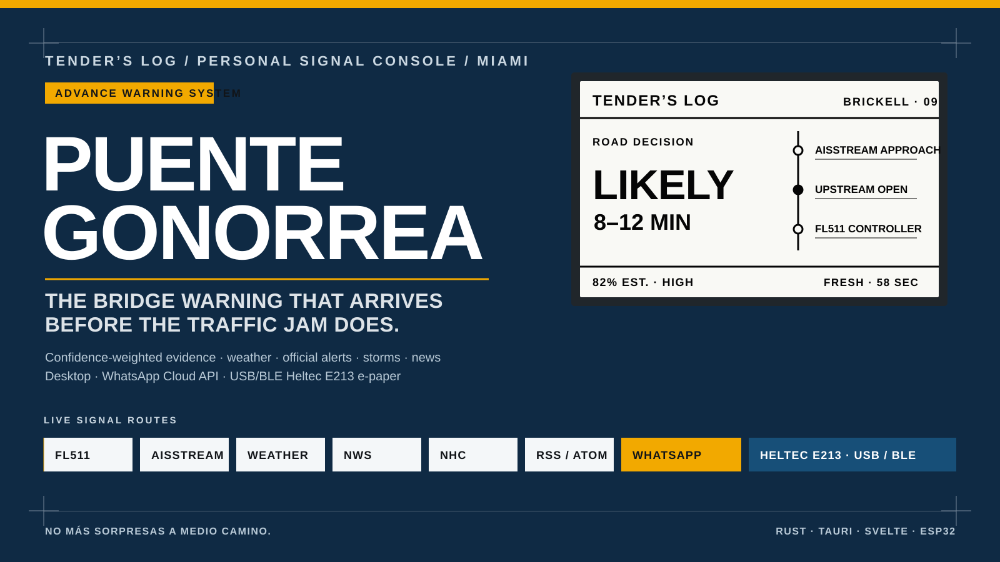

<p align="center">
  
</p>

<p align="center">
  
  
  
  
  
</p>

---

## The app is unsigned. Your OS will refuse to open it the first time.

There is no code-signing certificate behind these builds, so macOS Gatekeeper
and Windows SmartScreen block them until you approve the app by hand. This is
expected, and it takes about twenty seconds.

### macOS

1. Download the DMG for your Mac from [Releases](../../releases) —
   `macos-arm64` for Apple Silicon, `macos-x86_64` for Intel. Open it and drag
   **Tender's Log** onto the **Applications** folder beside it.
2. Launch it from Applications. macOS says it *"cannot be opened because Apple
   cannot check it for malicious software"*.
3. Click **Done**. **Do not click "Move to Trash"** — that deletes the app and
   you start over.
4. Open **System Settings → Privacy & Security** and scroll to the **Security**
   section. A line names Tender's Log as blocked. Click **Open Anyway** and
   authenticate.
5. Launch the app again and click **Open** on the last prompt. macOS remembers
   the decision; you only do this once per version.

If step 4 shows nothing, the launch in step 2 did not register — try opening the
app again, then go back to Privacy & Security.

### Windows

1. Download `Tenders-Log_<version>_windows-x64-setup.exe` from
   [Releases](../../releases) and run it.
2. SmartScreen says *"Windows protected your PC"*. Click **More info**, confirm
   the app name, then click **Run anyway**. Do not disable SmartScreen
   globally — this approval is for this one installer.
3. The installer runs per-user: no administrator prompt, and the app lands in
   your Start Menu. Windows 11 already ships the WebView2 runtime the app uses;
   on a machine without it, the installer fetches it automatically.

---

## What it is

**PuenteGonorrea** is the repository. **Tender's Log** is the app inside it: a
local-first desktop console that watches the Miami River, decides whether
anything deserves your attention, and says so once — on screen, on a 2.13-inch
e-paper display, via native notification, or over WhatsApp.

The flagship channel warns that the Brickell Avenue Bridge is likely to open
*before* traffic stacks up, rather than confirming it after the fact. It reads
FL511 bascule status for Brickell and the eight bridges upstream of it, the
Biscayne Bay Pilots dispatch board for scheduled river transits, and the bridge's
own legal operating schedule, then weighs those against each other with explicit
confidence and freshness rather than firing on any single signal. The same engine
handles rain heads-ups, NWS alerts, tropical systems, earthquakes, and RSS feeds
through the same policy, so adding a channel does not turn the app into a
notification casino.

Everything runs on your machine. There is no account, no server, and no
telemetry. Secrets live in a private per-user credential file — sealed to your
Windows account with DPAPI, held owner-only on macOS — and are never written to
preferences.

> **Proof-of-concept, August 2026.** FL511 bridge history is accumulating and the
> prediction weights are calibrated against only a few hours of it, so treat the
> confidence numbers as early. AISStream is delivering vessel detail again (the
> [upstream issue](https://github.com/aisstream/aisstream/issues/30) remains open,
> so treat availability as provider-intermittent); the collector now tracks the
> Miami River in channel coordinates along a surveyed corridor and records every
> bridge-line crossing into a per-vessel opening ledger — see
> [`docs/AIS_DISCOVERY.md`](docs/AIS_DISCOVERY.md) for the live discovery session
> behind that design. The South Miami Avenue bascule sits between Brickell and
> SW 2 Ave and FL511 does not publish it, which leaves a permanent blind spot
> immediately upstream of the target.

## Running from source

Requires Rust 1.97.1, Node 24, and npm 11.18.0. PlatformIO is optional and only
needed to build the panel firmware the app can flash.

```sh
npm --prefix apps/console ci
npm --prefix apps/console run tauri:dev      # console + desktop shell
cargo test --workspace                       # Rust tests
npm --prefix apps/console test               # console tests
npm --prefix apps/console run tauri:build:mac  # unsigned DMG
npm --prefix apps/console run tauri:build:win  # unsigned Windows installer, cross-compiled
```

The Windows executable and NSIS installer are cross-compiled from macOS — no
Windows machine involved except for testing. The one-time toolchain setup and
the QA protocol live in [`docs/WINDOWS_RELEASE.md`](docs/WINDOWS_RELEASE.md).

`desktop:prepare` generates the three inputs the Tauri build needs — bundled
license texts, the panel firmware bundle, and the compiled frontend — and runs
automatically before a build. Without PlatformIO the firmware bundle is written
empty and the app reports that it ships no firmware.

## Layout

`apps/console` is the SvelteKit UI, `apps/desktop/src-tauri` the desktop shell,
`crates/` the engine (collectors, policy, storage, e-paper rendering), and
`firmware/panel` the Arduino firmware for the display. [`DESIGN.md`](DESIGN.md)
covers the interface contract, [`PRODUCT.md`](PRODUCT.md) the product intent, and
[`CONTRIBUTING.md`](CONTRIBUTING.md) how to work on it.

Dependencies are pinned in lockfiles and updated by Dependabot on a 48-hour
cooldown, so a freshly published release cannot be pulled in before anyone has
had a chance to look at it. See [`SECURITY.md`](SECURITY.md).

## Why the name

*Puente* is Spanish for bridge. The rest is what Miami drivers call this
particular one, at roughly the fourth consecutive opening.

## License

MIT — see [`LICENSE-MIT`](LICENSE-MIT). Bundled fonts, icons, map software, and
live map data keep their own terms; see
[`THIRD_PARTY_NOTICES.md`](THIRD_PARTY_NOTICES.md).
[`LICENSE-APACHE`](LICENSE-APACHE) remains in the tree only as the canonical
Apache-2.0 text for bundled dependencies that ship without their own copy.

<p align="center">
  <strong>WARN AHEAD. CONFIRM LATER. NEVER FAKE FRESHNESS.</strong><br />
  <sub>Hecho con cariño, evidencia, y una cantidad razonable de rabia de tráfico.</sub>
</p>
