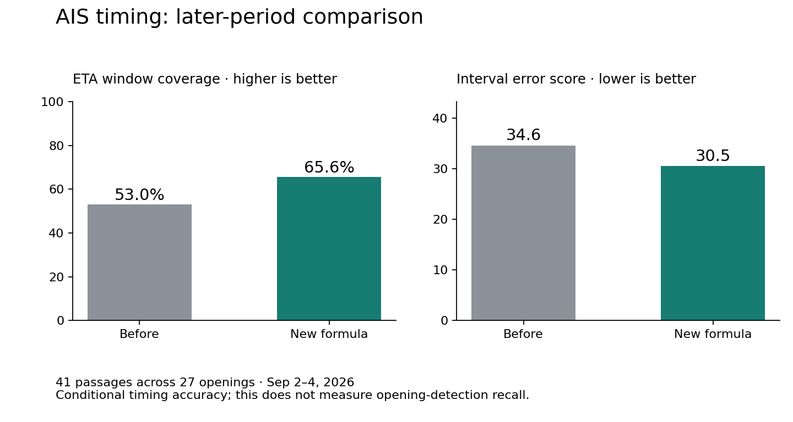

# Bridge model audit — September 4, 2026

The supported improvement is **AIS timing**, not a claim that the whole app now
predicts openings with 90% accuracy. On later, unseen-during-fitting passages,
the new bounded ETA formula covers the observed FL511 lift **65.6%** of the time
versus **53.0%** for the old formula. Opening-classification challengers did not
justify replacing the existing decision weights.

The changes are in the source tree as `brickell-v6`. The running installed app
was not restarted, its preferences and live database were not modified, and no
message or hardware action was triggered.

## Data and outcome quality

A consistent SQLite backup was taken through a read-only connection. The
snapshot contains 107,740 AIS fixes, 240 crossings from 86 crossing hulls,
464 catalogued hulls, 17,538 forecast samples, 3,966 bridge intervals, and 68
pilot-board records. The AIS record starts August 18; usable continuous bridge
coverage starts August 23. The snapshot ends September 4 at about 18:03 Eastern.

There are **229 clean target openings**, including 166 on weekdays, and
**284.2 confirmed hours** out of 295.2 elapsed hours (96%). Fifty-three coverage
gaps and 204 legacy intervals are not treated as continuous observation.
Forecast outcomes require the entire following 30 minutes to be observed.
Brief or otherwise ambiguous up readings are excluded from negative labels.

“Opening” here means a witnessed FL511 down-to-up transition with a subsequent
confirmation. It is not an independently timed physical lift. Provider latency
remains part of the measurement.

Older forecast timestamps can precede collection completion by the network
request duration. Historical warning leads may therefore be optimistic by that
unrecorded delay. v6 fixes the timestamp boundary; it cannot recover missing
availability timestamps in old rows.

| Source | What the record supports | Limits / decision |
| --- | --- | --- |
| FL511 target | 229 clean transitions and explicit coverage intervals | Use as the outcome; never include future target state as a predictive feature. |
| FL511 upstream | SW 2 Ave 234 clean lifts; W Flagler 113; NW 5 St 620; NW 12 Ave 115; NW 22 Ave 135; NW 27 Ave 96 | Ordered runs have about 1.66× lift for a 15-minute outcome, below the existing 2× gate for increasing weights. |
| Sparse upstream channels | SW 1 St now has 23 clean lifts; NW 17 Ave has none | A zero count is not evidence of a dependable negative signal. Do not assume every bridge has equivalent sensitivity. |
| AIS crossings | 161 `opened`, 58 `fits_under`, 21 `unknown`; all ledger counters agree with crossing rows | A hull passing during an opening does **not** prove it required that opening. Current propensity measures association. No invented air draft or retroactive present-day identity features were used. |
| AIS trajectories | 112 opening-linked passages have usable past-only closing motion | Weight each passage equally; fixes from one slow vessel are not independent examples. |
| BBP | 8 same-hull downriver matches, median −9 minutes; 9 upriver, median +56 minutes | These are offsets to **crossing**, not lift time. Neither direction reaches the 20-pair calibration gate. Keep the −8/+60 placeholders explicitly uncalibrated. |

Pilot-board final rows can contain schedule revisions. Their final schedule
cannot safely be projected backwards as if it were known at first observation.
The classification tournament therefore uses the transit contribution actually
stored at each forecast, not a retrospective final-board reconstruction.

## Before and after: the timing formula being added

Training uses 35 passages before August 29; validation uses 36 more before
September 2. Only outcomes resolved before each split enter fitting. Testing
uses **41 later passages across 27 distinct openings**, September 2–4.

The regression predicts time until the lift from channel distance divided by
closing speed. Closing speed uses only earlier fixes from the same session and
branch, with implausible jumps rejected. It does not use future vessel fixes.
Regularized quantile regression was tested at three regularization strengths;
the earlier validation period selected `alpha=0.1`.

For dead-reckoning minutes `m`, the supported routes use:

```text
lower = max(1, floor(0.3827277924503293 × m − 0.5180574755560712))
upper = min(90, max(lower, ceil(0.7351174400510498 × m + 9.850829397952298)))
```

The additive allowance captures waiting and the tender's lead time, which a
pure multiplier forces to vanish as the vessel approaches. The fitted route
offset coefficients shrink to zero; extra route parameters did not earn their
complexity. The fitted bounds apply to outbound river traffic (33 training
passages) and inbound Government Cut (30). Other routes retain their prior
formula because their support is below 20 passages.

| Conditional AIS timing metric | Before | New bounded formula |
| --- | ---: | ---: |
| Lift inside ETA window | 53.0% | **65.6%** |
| Mean absolute midpoint error | 9.35 min | **8.68 min** |
| Mean window width | 16.65 min | 18.20 min |
| Central 60% interval error score, lower is better | 34.60 | **30.51** |

The interval score penalizes width as well as misses:
`(upper − lower) + 5 × max(lower − actual, 0) + 5 × max(actual − upper, 0)`.
Thus improvement is not credited simply for making every interval enormous.
Each passage has equal weight. The midpoint error compares interval midpoints
for both formulas; it does not quietly substitute the separately fitted median.

A paired bootstrap resampling **openings**, preserving convoy dependence,
gives a 95% interval of **+3.7 to +23.5 percentage points** for coverage change
and **−8.29 to −0.29** for interval-score change. The midpoint-error interval
includes zero; a material point-accuracy improvement is not established.
These intervals condition on this small test period, not future seasonal drift.



These numbers evaluate the AIS timing component **before schedule adjustment,
source fusion, and alert gating**. They are conditional on an opening-linked
passage. They do not measure false alerts, missed vessels, or end-to-end v6
opening recall. Route safeguards and output rounding were checked after the
initial fit evaluation; this test period is now used research data, not a fresh
future deployment test.

## Opening classification: a replacement was tested and rejected

The tournament compared 12 configurations: regularized logistic models of the
existing score, source/ETA fusion, and source fusion plus causal bridge history;
shallow gradient-boosted trees; and a shallow random forest. Eight entry/exit
threshold pairs were evaluated for each configuration. Features included AIS,
outbound and pilot-board contributions, ETA, legal mode, local time, and past
target/upstream lifts. No present-day vessel ledger was joined into the past.

Three expanding chronological validation folds cover August 26–28, 28–30, and
August 30–September 2. Training is purged by 30 minutes plus the confirming
reading delay. The winning configuration and threshold were written before
its September 2–4 test evaluation. The objective was mean episode F1 across
folds, with Brier score as a tie-breaker. This follows the temporal separation
principle in [scikit-learn's time-series validation documentation](https://scikit-learn.org/stable/modules/generated/sklearn.model_selection.TimeSeriesSplit.html).

| Best configuration in each family | Validation episode F1 |
| --- | ---: |
| Logistic calibration of existing score | 0.542 |
| Logistic source/ETA fusion | 0.487 |
| Logistic fusion + bridge history | 0.486 |
| Shallow gradient boosting | 0.483 |
| Shallow random forest | 0.482 |

On the **same 3,479 eligible minutes and 45 openings** in the later test:

| Metric | Recorded v5 | Validation-winning challenger |
| --- | ---: | ---: |
| Alert precision | 38.6% | 43.5% |
| Opening recall | **75.6%** | 66.7% |
| Correctly warned openings | **34 / 45** | 30 / 45 |
| Unmatched alert episodes | 54 | 39 |
| Median warning lead | **18.2 min** | 13.6 min |
| Minute classification accuracy | **74.0%** | 72.8% |
| Balanced minute accuracy | **63.6%** | 60.8% |
| Brier score, lower is better | 0.1886 | 0.1811 |

The modest F1 and probability-score gain costs four detected openings and
warning time. That does not justify replacing the decision weights. Score
calibration is also not evidence of a better ranker: the winning monotone
transform leaves the ranking and ROC AUC unchanged. As the
[calibration documentation](https://scikit-learn.org/stable/modules/calibration.html)
explains, Brier score combines reliability and discrimination; it is not a
standalone percentage accuracy.

An always-clear policy already scores 66.5% minute accuracy while missing every
opening. That is why a single accuracy number is an inadequate success metric.
Alert episodes are matched to openings one-to-one within 30 minutes, and a
continuous warning is not counted as a new success every minute.

Exploratory dwell filters reduced repeated alerts but also lost recall; these
were not promoted. The original ranker's weights and entry/exit thresholds
remain unchanged. “Best” means best among the candidates tested under the
stated objective, not a proof that no better algorithm exists.

## Other mathematical defects fixed

- A slow inbound ETA could call `clamp(105, 90)` and panic. An unsupported lower
  bound now returns no ETA; it is not forced earlier to fit the display cap.
- The policy truncated wide windows merely to look actionable, including
  changing 9–42 into 9–29 minutes. That could manufacture an alert inside the
  30-minute limit. Supported uncertainty is now preserved.
- Upstream travel distances now follow the shared river centreline. W Flagler
  is about 1,459 channel metres away, versus the old 1,223-metre lookup. Existing
  speed bounds remain unchanged.
- A distant exempt tug booking could exempt an unrelated ordinary vessel's ETA
  and AIS score. Schedule handling now applies to each vessel's own hypothesis.
- Forecast timestamps now use collection completion, rather than claiming the
  newly received information was known when the network request began. Future
  observations cannot become fresh predictive or authoritative evidence.
- A pilot-board time 30 seconds in the past used to round to zero minutes and
  remain a future movement. It is now expired. Empty tug text cannot establish
  an exemption.

These are correctness changes. The old aggregate trace lacks enough individual
inputs to calculate an honest end-to-end before/after score for all of them.

## Reproduction and the next verification loop

Keep raw snapshots and replay exports outside the repository. To create a
consistent snapshot without writing to the live database:

```python
from contextlib import closing
from pathlib import Path
import os
import sqlite3

source = Path.home() / "Library/Application Support/com.cmiami.brickellstatus/brickellstatus.sqlite3"
destination = Path("/tmp/brickell-audit-history.sqlite3")  # choose a new path
os.close(os.open(destination, os.O_WRONLY | os.O_CREAT | os.O_EXCL, 0o600))
with closing(sqlite3.connect(source.as_uri() + "?mode=ro", uri=True)) as live:
    with closing(sqlite3.connect(destination)) as snapshot:
        live.backup(snapshot)
```

Use the optional research environment; these packages are not app dependencies:

```sh
uv venv --python 3.13 /tmp/brickell-audit-env
uv pip install --python /tmp/brickell-audit-env/bin/python -r scripts/model-audit-requirements.txt
/tmp/brickell-audit-env/bin/python scripts/audit_bridge_model.py /tmp/brickell-audit-history.sqlite3 --output /tmp/brickell-model-results
/tmp/brickell-audit-env/bin/python scripts/audit_ais_timing.py /tmp/brickell-audit-history.sqlite3 --output /tmp/brickell-timing.json --chart /tmp/brickell-timing.png
```

The recorded snapshot SHA-256 and aggregate results are in
[forecast results](MODEL_AUDIT_FORECAST_RESULTS.json),
[all candidate validation results](MODEL_AUDIT_MODEL_SELECTION.json), and
[timing results](MODEL_AUDIT_TIMING_RESULTS.json). The small deployable parameter
artifact is [ais_timing_v1.json](../crates/collectors/models/ais_timing_v1.json).

New builds record normalized evidence, source timestamps/health, the policy
configuration, prior hysteresis state, and the full prediction. Exact records
retain material changes within a minute and expire after 30 days; compact
historical summaries remain. Future replays no longer need to invent historical
per-vessel propensity or reconstruct final pilot-board schedules.

```sh
python3 scripts/export_bridge_replay.py /path/to/brickellstatus.sqlite3 --output /tmp/bridge-replay.jsonl
cargo run -p brickellstatus-policy --example replay_bridge --locked < /tmp/bridge-replay.jsonl
node scripts/verify.mjs all
```

The exporter uses a read-only connection, refuses to overwrite an existing file,
and creates exports with owner-only permissions. The replay verifier fails on
different predictions, different model revisions, or an empty input. A model
revision mismatch is an expected comparison boundary, not evidence of a bug.

After the new build accumulates data, compare v6 alert precision, recall, lead,
and ETA coverage on fresh dates with full observed outcomes. Do not present
the component timing gain above as an already measured live v6 alert gain.

## Verification completed

595 Rust tests, 162 console tests, and 13 Python tests passed. Rust formatting,
Clippy with warnings denied, Svelte/TypeScript checking, generated-input
preparation, and the production console build passed. The last schedule-scope
change was followed by a fresh complete Rust test run and workspace Clippy.
The exported timing chart was visually inspected. Verification used the
temporary Node 24.15 runtime documented in `CODE_AUDIT.md`; the global Node
installation remains unchanged.
